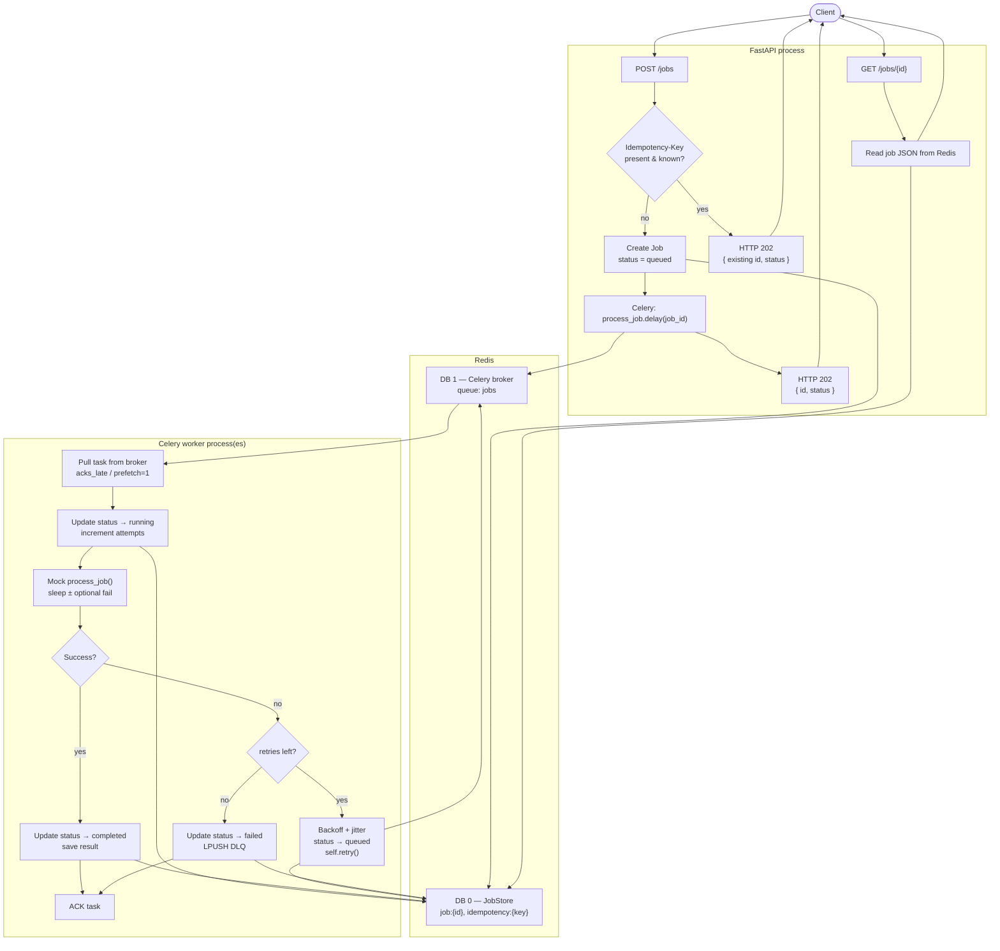
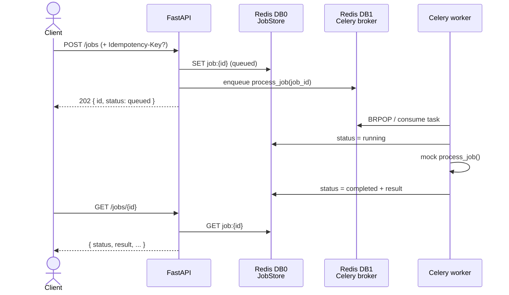

# Async Job Processing API

REST API that accepts job submissions, processes them with **Celery** workers
over Redis, and exposes job status/results for polling.

## Features

- **Job submission** — `POST /jobs` returns a job ID immediately (`202`)
- **Celery workers** — separate processes; scale with concurrency / replicas
- **Redis** — job state + idempotency keys (DB 0); Celery broker (DB 1)
- **Status API** — `GET /jobs/{id}` → `queued` / `running` / `completed` / `failed`
- **Retries** — Celery `self.retry` with exponential backoff + jitter
- **DLQ + replay** — permanent failures land in a dead-letter list; `POST /jobs/{id}/replay`
- **Stuck-job reaper** — Celery Beat fails jobs stuck in `running` and sends them to the DLQ
- **Job TTL** — records expire (`JOB_TTL_SECONDS` from env) so they cannot live forever
- **Crash safety** — `acks_late` + `reject_on_worker_lost`
- **Idempotent submit** — optional `Idempotency-Key` header

## Deploy (DigitalOcean App Platform)

Infrastructure lives under [`.do/app.yaml`](.do/app.yaml) and
[`infra/digitalocean/README.md`](infra/digitalocean/README.md).

```text
api + celery-worker + celery-beat  →  managed Valkey (Redis-compatible)
```

```bash
# 1) Set github.repo in .do/app.yaml
# 2) Create the app
doctl apps create --spec .do/app.yaml
```

## Quick start (Docker)

```bash
cp .env.example .env.docker   # if needed — repo includes .env.docker
docker compose up --build
```

Compose loads **`.env.docker`** into api/worker/beat. Host port mapping reads
`REDIS_PUBLISH_PORT` / `API_PUBLISH_PORT` from the project **`.env`** file
(Compose variable substitution).

- API: http://localhost:${API_PUBLISH_PORT}/docs  
- Redis + Celery worker + Beat start automatically

## Local setup (without Docker for the app)

```bash
cp .env.example .env          # required — app refuses to start with missing vars
docker compose up -d redis
python -m venv .venv && source .venv/bin/activate
pip install -r requirements.txt

# terminal 1 — API (host/port from .env)
./scripts/run_api.sh

# terminal 2 — Celery worker (concurrency + queue from .env)
./scripts/run_worker.sh

# terminal 3 — Celery Beat (reaper + TTL purge)
./scripts/run_beat.sh
```

## Configuration

**All runtime values are read from the environment.** There are no in-code
defaults — missing variables raise `ConfigError` at startup.

| File | Purpose |
| --- | --- |
| `.env.example` | Template (committed) |
| `.env` | Local host runs + Compose port substitution (gitignored) |
| `.env.docker` | Values injected into Compose services (`redis` hostname) |

| Env var | Meaning |
| --- | --- |
| `REDIS_URL` | Job state / idempotency / DLQ |
| `CELERY_BROKER_URL` | Celery broker |
| `CELERY_CONCURRENCY` | Worker process concurrency |
| `CELERY_QUEUE` | Celery queue name |
| `CELERY_PREFETCH_MULTIPLIER` | Worker prefetch |
| `MAX_RETRIES` | Retries after first failure |
| `BASE_BACKOFF_SECONDS` | Retry backoff base |
| `RETRY_JITTER_RATIO` | Jitter fraction for backoff |
| `MOCK_WORK_SECONDS` | Default mock sleep |
| `IDEMPOTENCY_TTL_SECONDS` | Idempotency key TTL |
| `JOB_TTL_SECONDS` | Absolute job record lifetime |
| `STUCK_RUNNING_SECONDS` | Reaper threshold for stuck `running` |
| `REAPER_INTERVAL_SECONDS` | Beat interval for stuck reaper |
| `PURGE_INTERVAL_SECONDS` | Beat interval for expired index cleanup |
| `JOB_LOCK_TIMEOUT_SECONDS` | Redis job lock TTL |
| `JOB_LOCK_BLOCKING_TIMEOUT_SECONDS` | Max wait to acquire lock |
| `DLQ_LIST_DEFAULT_LIMIT` | Default `GET /dlq` page size |
| `API_HOST` / `API_PORT` | Uvicorn bind address |
| `LOG_LEVEL` | Celery / app log level |
| `REDIS_PUBLISH_PORT` / `API_PUBLISH_PORT` | Host ports for Compose |

## API usage

```bash
# submit (optional idempotency)
curl -s -X POST http://localhost:8000/jobs \
  -H 'Content-Type: application/json' \
  -H 'Idempotency-Key: client-req-123' \
  -d '{"data": {"task": "demo"}, "work_seconds": 1}'

# status
curl -s http://localhost:8000/jobs/<id>

# dead-letter queue
curl -s http://localhost:8000/dlq

# replay a failed job (clears DLQ entry, re-enqueues)
curl -s -X POST http://localhost:8000/jobs/<id>/replay

# health
curl -s http://localhost:8000/health
```

## Run tests

Tests use **fakeredis** + Celery **eager** mode (no live broker/worker required).
A project `.env` must exist so `app.config` can import (copy from `.env.example`).

```bash
cp -n .env.example .env
pytest -q
```

## Architecture

### End-to-end flow



### Step-by-step

1. **Submit** — Client calls `POST /jobs` (optional `Idempotency-Key`).
2. **Dedupe** — If the key was seen before, return the same job ID (no new work).
3. **Persist** — Otherwise write `job:{id}` to Redis DB 0 with `status=queued`.
4. **Enqueue** — `process_job.delay(job_id)` pushes a Celery message to Redis DB 1; API returns **202** immediately.
5. **Execute** — A Celery worker pulls the task, sets `running`, runs mock work.
6. **Finish** — On success → `completed` + result. On failure → retry with backoff/jitter, or `failed` when retries are exhausted.
7. **Poll** — Client calls `GET /jobs/{id}`; API reads the latest record from Redis DB 0.

### Sequence (happy path)



## Why Celery (vs in-process threads)

| | Threads in API | Celery |
|---|---|---|
| Scale workers independently | No | Yes |
| Survive API process restart mid-queue | No | Yes (broker) |
| Multi-host workers | No | Yes |
| Prefetch / ack semantics | Homegrown | Built-in |

## Known limitations

- **Mock work only** — sleep + optional forced failure
- **No auth / rate limits** (intentionally out of scope)
- **Stuck reaper fails to DLQ** (does not auto-requeue) — use `POST /jobs/{id}/replay`
- **Eager tests ≠ full broker** — run `docker compose` (api + worker + beat) for an end-to-end check
